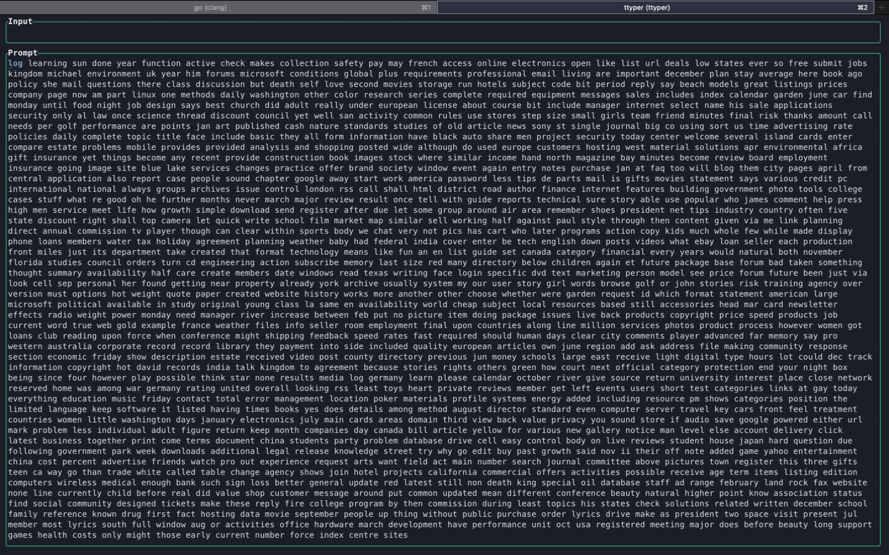
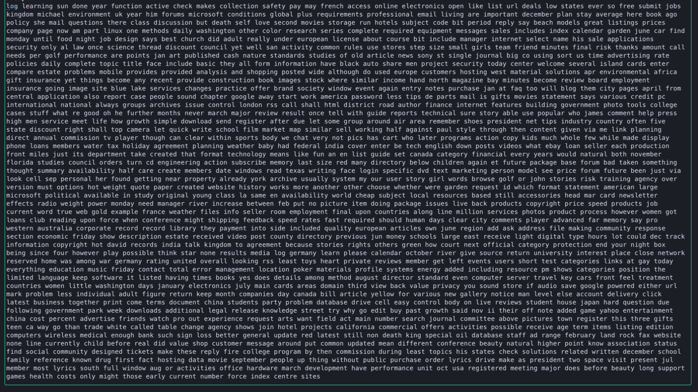

# Typing Game Automation Bot

This project is a simple automation bot for the terminal-based typing game [ttyper](https://github.com/MaxCodesIO/ttyper). It leverages Go for image processing, OCR (Optical Character Recognition), and input automation. The bot is designed to enhance typing speed in the game while serving as a hands-on experiment in game automation, pattern recognition, and Go programming.

## Project Motivation

This project aims to:

1. Explore game automation on an offline game to ensure it doesn't affect other players' experiences.
2. Serve as a foundation for understanding and experimenting with automation, pattern recognition, and Go language programming.
3. Provide a base for future larger-scale automation experiments.

## Features

- Captures the game window via screenshot.
- Preprocesses the image by cropping and converting it into a binary (black-and-white) format for improved OCR accuracy.
- Uses OCR to extract text from the processed image.
- Simulates typing the extracted text into the game window.
- Designed for macOS with tesseract OCR.

## Project Structure

```
.
├── go.mod
├── go.sum
├── main.go
└── screenshots
    ├── binary.png          # Binary image after preprocessing
    ├── cropped.png         # Cropped image for OCR
    └── screenshot.png      # Original screenshot of the game window
```

## How It Works

1. **Screen Capture**: Captures the screen of the primary display using the `kbinani/screenshot` package.
2. **Image Preprocessing**: Crops the game area and converts the image to binary for better OCR performance.
3. **Text Extraction**: Extracts text using the Tesseract OCR library.
4. **Simulated Typing**: (Currently disabled) Simulates typing the extracted text into the game window using `robotgo`.

### Workflow

- **Capture**: Captures a screenshot of the current display.
- **Preprocess**: Crops the image to focus on the typing area and converts it to binary.
- **OCR**: Extracts text from the binary image.
- **Automation**: Simulates typing the text into the game window. (Currently outputs extracted text to the terminal.)

## Requirements

1. **Dependencies**: Install Go and the required packages listed in `go.mod`.
2. **Tesseract OCR**: Install Tesseract OCR. Note that macOS users may encounter issues due to limited ARM support.
3. **Permissions**: On macOS, grant permissions for screen recording and accessibility to allow automation.

## Installation and Usage

1. Clone this repository and navigate to the project folder.
2. Install dependencies and ensure Tesseract is installed and in your system's PATH.
3. Run the game (`ttyper`) in one terminal window.
4. Open another terminal window and execute:

   ```bash
   go run main.go
   ```

5. Switch to the ttyper window (fullscreen) and watch the automation in action.

## Screenshots

### Example Images

<table>
  <tr>
    <th>Screenshot</th>
    <th>Cropped Image</th>
    <th>Binary Image</th>
  </tr>
  <tr>
    <td></td>
    <td></td>
    <td></td>
  </tr>
</table>

### Video Demo

(To be added later. Placeholder for embedding a video demonstration.)

## Limitations

1. **OCR Accuracy**: The bot uses Tesseract OCR, which is resource-intensive and may not always extract text perfectly.
2. **Typing Speed**: Currently, `robotgo` types at around 2000 WPM. To increase speed, consider implementing clipboard-based pasting instead.
3. **Platform Dependency**: The project is developed on macOS and may not work out of the box on other platforms.
4. **Game Compatibility**: The bot is tailored for ttyper and lacks looping mechanisms to handle scrolling text in other games.

## Future Plans

This project is not actively maintained. However, if you encounter issues or have ideas for improvement, feel free to open an issue. Contributions are welcome, but there are no guarantees for updates or fixes.

## License

This project is licensed under the MIT License. See [LICENSE](LICENSE) for details.

## Acknowledgments

- The game [ttyper](https://github.com/MaxCodesIO/ttyper) for providing a simple and engaging typing experience.
- [Ahmad Rosid](https://ahmadrosid.com/blog/golang-img-crop) for helpful resources on image processing in Go.
- The authors of the Go libraries and tools used in this project, including:
  - [kbinani/screenshot](https://github.com/kbinani/screenshot)
  - [disintegration/imaging](https://github.com/disintegration/imaging)
  - [tiagomelo/go-ocr](https://github.com/tiagomelo/go-ocr)

## Notes

This project is a personal experiment and learning exercise. If you want to use or extend it, feel free to fork the repository and modify it as needed. Have fun!

