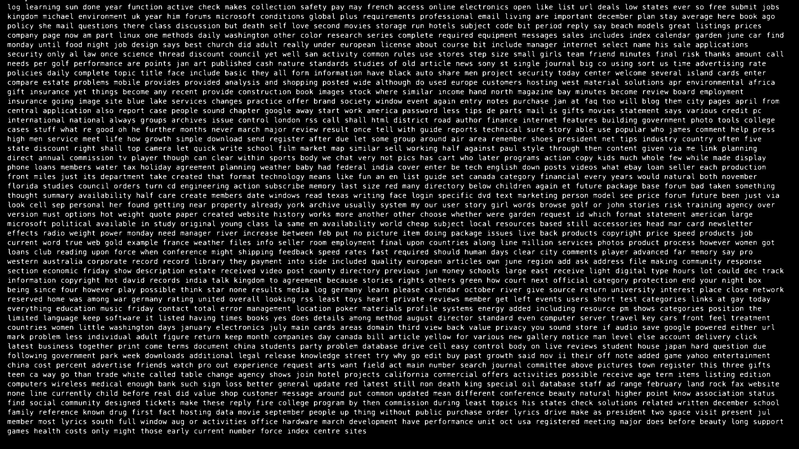

# Typing Game Automation Bot

This project is a simple automation bot for the terminal-based typing game [ttyper](https://github.com/MaxCodesIO/ttyper). It leverages Go for image processing, OCR (Optical Character Recognition), and input automation. The bot is designed to enhance typing speed in the game while serving as a hands-on experiment in game automation, pattern recognition, and Go programming.

## Project Motivation

This project aims to:

1. Explore game automation on an offline game to ensure it doesn't affect other players' experiences.
2. Serve as a foundation for understanding and experimenting with automation, pattern recognition, and Go language programming.
3. Provide a base for future larger-scale automation experiments.

## Features

- Captures the game window via screenshot.
- Preprocesses the image by cropping and converting it into a binary (black-and-white) format for improved OCR accuracy.
- Uses OCR to extract text from the processed image.
- Simulates typing the extracted text into the game window.
- Designed for macOS with tesseract OCR.

## Project Structure

```
.
├── go.mod
├── go.sum
├── main.go
└── screenshots
    ├── binary.png          # Binary image after preprocessing
    ├── cropped.png         # Cropped image for OCR
    └── screenshot.png      # Original screenshot of the game window
```

## How It Works

1. **Screen Capture**: Captures the screen of the primary display using the `kbinani/screenshot` package.
2. **Image Preprocessing**: Crops the game area and converts the image to binary for better OCR performance.
3. **Text Extraction**: Extracts text using the Tesseract OCR library.
4. **Simulated Typing**: (Currently disabled) Simulates typing the extracted text into the game window using `robotgo`.

### Workflow

- **Capture**: Captures a screenshot of the current display.
- **Preprocess**: Crops the image to focus on the typing area and converts it to binary.
- **OCR**: Extracts text from the binary image.
- **Automation**: Simulates typing the text into the game window. (Currently outputs extracted text to the terminal.)

## Requirements

1. **Dependencies**: Install Go and the required packages listed in `go.mod`.
2. **Tesseract OCR**: Install Tesseract OCR. Note that macOS users may encounter issues due to limited ARM support.
3. **Permissions**: On macOS, grant permissions for screen recording and accessibility to allow automation.


## Installation and Usage

### 1. Clone the Repository

Use `git` to clone this project and navigate into the folder:

```bash
git clone https://github.com/orca1018/Typing-Game-Automation-Bot
cd Typing-Game-Automation-Bot
```

---

### 2. Install Dependencies

Make sure you have **Go** installed (Go 1.18 or higher is recommended). Then tidy up dependencies:

```bash
go mod tidy
```

---

### 3. Install Tesseract OCR

You need to install Tesseract and ensure it's available in your system's PATH.

#### macOS:
```bash
brew install tesseract
```

#### Ubuntu / Debian:
```bash
sudo apt update
sudo apt install tesseract-ocr
```

#### Windows:
1. Download the Windows installer from: https://github.com/UB-Mannheim/tesseract/wiki
2. Install it and note the install path (e.g. `C:\Program Files\Tesseract-OCR`)
3. Add that folder to your **System PATH**
4. Open Command Prompt and test with:
```bash
tesseract --version
```

---

### 4. Run the Typing Game

Launch the game in a terminal window:

```bash
ttyper
```

Make sure the game is in fullscreen or maximized so the OCR has a clean view.

---

### 5. Run the Bot

In a **second terminal window**, run the bot:

```bash
go run main.go
```

Then switch back to the terminal running `ttyper` — the bot will take over from there and start typing automatically.

---

That’s it — you’re ready to watch your bot dominate the keyboard. 

## Screenshots

### Example Images

<table>
  <tr>
    <th>Screenshot</th>
    <th>Cropped Image</th>
    <th>Binary Image</th>
  </tr>
  <tr>
    <td></td>
    <td></td>
    <td></td>
  </tr>
</table>

### Video Demo

#### Note on Performance
Please note that Tesseract OCR can be quite slow depending on your hardware. After running the bot, it might take a while before the typing begins. Be patient and ensure that the game screen is in full focus while the bot processes the text.

#### Demo Video
Here is a short demo of the bot in action:


<sub>If the demo GIF doesn’t appear, [click here to view it directly](screenshots/demo.gif).</sub>

## Limitations

1. **OCR Accuracy**: The bot uses Tesseract OCR, which is resource-intensive and may not always extract text perfectly.
2. **Typing Speed**: Currently, `robotgo` types at around 2000 WPM. To increase speed, consider implementing clipboard-based pasting instead.
3. **Platform Dependency**: The project is developed on macOS and may not work out of the box on other platforms.
4. **Game Compatibility**: The bot is tailored for ttyper and lacks looping mechanisms to handle scrolling text in other games.

## Future Plans

This project is not actively maintained. However, if you encounter issues or have ideas for improvement, feel free to open an issue. Contributions are welcome, but there are no guarantees for updates or fixes.

## License

This project is licensed under the MIT License. See [LICENSE](LICENSE) for details.

## Acknowledgments

- The game [ttyper](https://github.com/MaxCodesIO/ttyper) for providing a simple and engaging typing experience.
- [Ahmad Rosid](https://ahmadrosid.com/blog/golang-img-crop) for helpful resources on image processing in Go.
- The authors of the Go libraries and tools used in this project, including:
  - [kbinani/screenshot](https://github.com/kbinani/screenshot)
  - [disintegration/imaging](https://github.com/disintegration/imaging)
  - [tiagomelo/go-ocr](https://github.com/tiagomelo/go-ocr)
  - [go-vgo/robotgo](https://github.com/go-vgo/robotgo)

## Notes

This project is a personal experiment and learning exercise. If you want to use or extend it, feel free to fork the repository and modify it as needed. Have fun!

